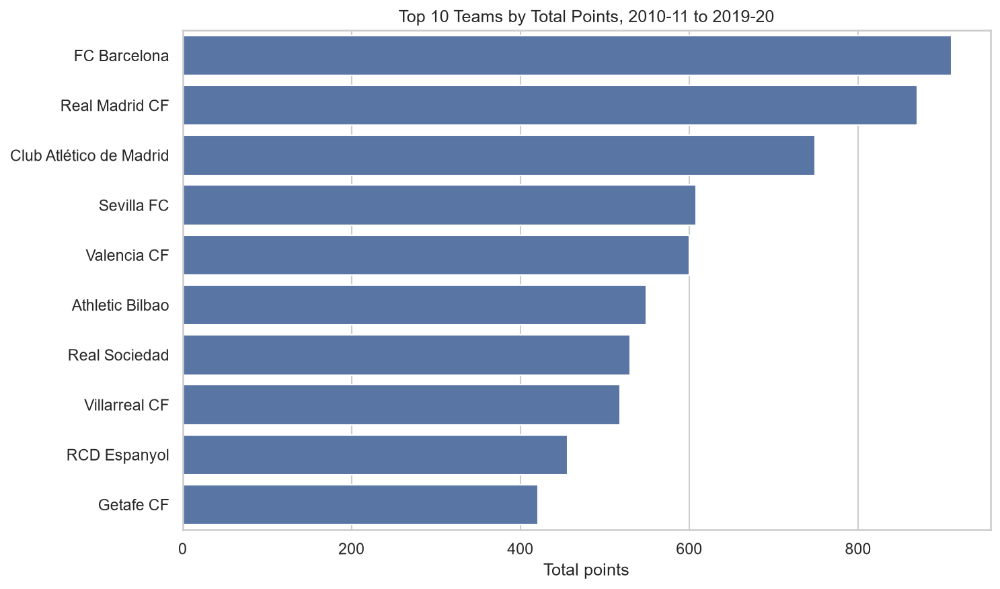
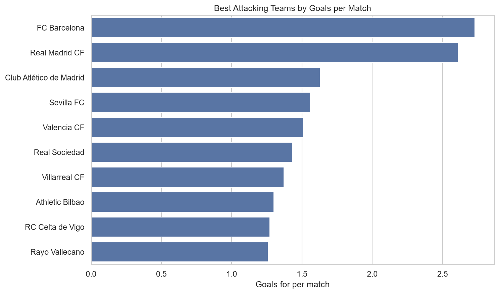
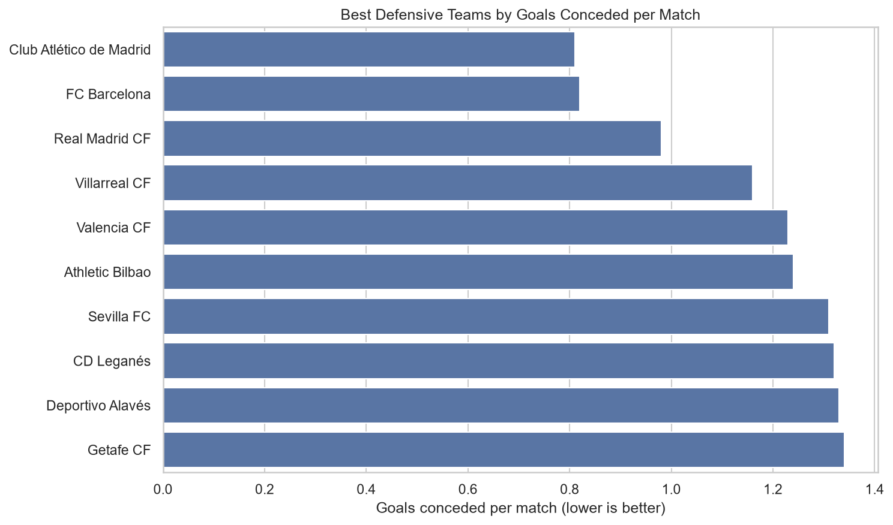
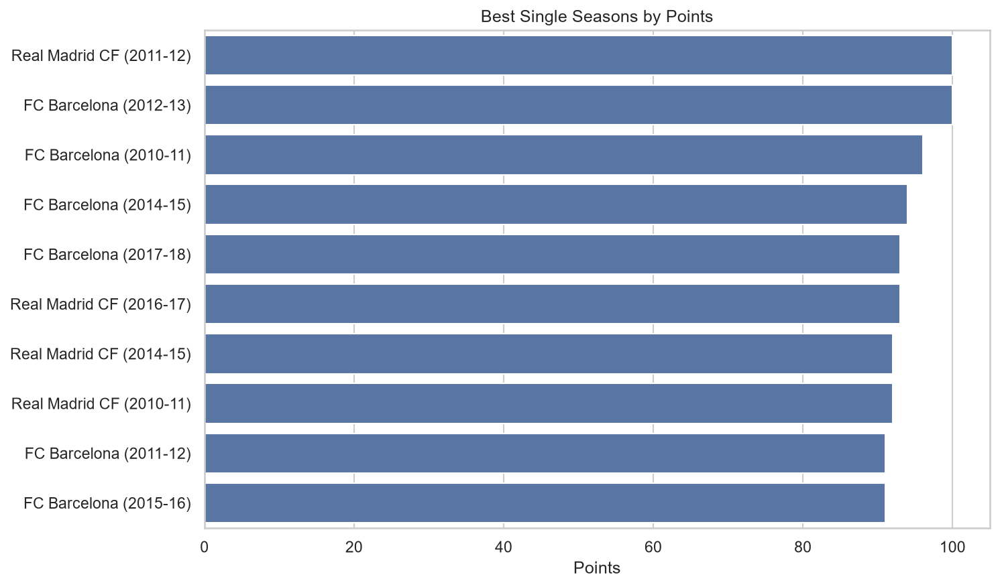

# La Liga Score Analysis Project

## Project Overview

This project is a complete rebuild of an older La Liga data analysis project, redesigned as a clean, reproducible and portfolio-ready analytics workflow.

The analysis covers Spanish La Liga seasons from **2010-11 to 2019-20**. Raw season-level CSV files are transformed into validated processed datasets and then used in a score-focused analytical report.

The project intentionally focuses on score-based football analysis rather than advanced match-event statistics.

Core analysis areas include:

- league results and scoring profile
- scoreline analysis
- league standings
- team season performance
- home and away performance
- wins, draws and losses
- goals scored and conceded
- clean sheets
- failed-to-score matches
- long-term team consistency
- best single-season performances

---


### Explore the Project

- [Data Preparation Notebook](notebooks/01_data_preparation.ipynb)
- [Analysis Report Notebook](notebooks/02_analysis_report.ipynb)
- [Processed Datasets](data/processed/)
- [Output Figures](outputs/figures/)

## Project Goals

The main goals of this project are:

1. Rebuild the original notebook-based project into a structured analytics workflow.
2. Separate raw data, processed data, source code, notebooks and reporting outputs.
3. Replace one-off notebook logic with reusable Python functions.
4. Build reproducible processed datasets from raw season files.
5. Add validation checks and reconciliation between derived datasets.
6. Create a focused analytical report with clear questions, visualizations and conclusions.
7. Produce a portfolio-ready project that can be extended in future phases.

---

## Data Source

The raw match data used in this project was obtained from [Football-Data.co.uk](https://www.football-data.co.uk/).

Football-Data.co.uk provides historical football results and match statistics for multiple leagues and competitions. This project uses the Spanish La Liga season CSV files covering:

- 2010-11
- 2011-12
- 2012-13
- 2013-14
- 2014-15
- 2015-16
- 2016-17
- 2017-18
- 2018-19
- 2019-20

The original CSV files are kept unchanged locally in `data/raw/`. For the public repository, the raw CSV files are not committed; users can download them directly from Football-Data.co.uk and place them in `data/raw/` before running the preparation pipeline.

All cleaning, validation, standardization and derived datasets are produced reproducibly through the project's Python pipeline.

Only score-based fields are used in the core analysis. Other statistics available in the source files, such as shots, cards and corners, are intentionally excluded from the current analytical scope.

---

## Dataset

The project uses raw match-level CSV files for 10 La Liga seasons:

```text
2010-11_SP1.csv
2011-12_SP1.csv
2012-13_SP1.csv
2013-14_SP1.csv
2014-15_SP1.csv
2015-16_SP1.csv
2016-17_SP1.csv
2017-18_SP1.csv
2018-19_SP1.csv
2019-20_SP1.csv
```

The raw files are used locally from:

```text
data/raw/
```

The public repository keeps the folder structure but does not redistribute the source CSV files. Raw files remain unchanged locally, and all cleaning, standardization and derived calculations are performed through the Python pipeline.

---

## Project Structure

```text
la-liga-analysis/
│
├── data/
│   ├── raw/
│   │   └── .gitkeep
│   │
│   └── processed/
│       ├── all_matches.csv
│       ├── participations.csv
│       ├── team_participation_counts.csv
│       ├── standings.csv
│       └── team_season_stats.csv
│
├── notebooks/
│   ├── 01_data_preparation.ipynb
│   └── 02_analysis_report.ipynb
│
├── src/
│   ├── __init__.py
│   ├── config.py
│   ├── load_data.py
│   ├── clean_data.py
│   ├── team_names.py
│   ├── validation.py
│   ├── standings.py
│   └── features.py
│
├── outputs/
│   ├── figures/
│   └── tables/
│
├── .gitignore
├── README.md
└── requirements.txt
```

The raw-data directory is intentionally kept empty in the public repository. Source season files should be downloaded from Football-Data.co.uk before reproducing the preparation pipeline.

---

## Data Pipeline

The data preparation workflow follows this sequence:

```text
raw season CSV files
↓
load raw data
↓
clean and standardize match data
↓
validate clean matches
↓
create participation tables
↓
create standings
↓
validate standings
↓
create team-season statistics
↓
validate team-season statistics
↓
export processed datasets
↓
analytical report
```

The pipeline is implemented in:

```text
notebooks/01_data_preparation.ipynb
```

The notebook is designed to run reproducibly from top to bottom with **Restart Kernel → Run All**.

---

## Source Modules

### `src/config.py`

Stores project paths and season configuration.

### `src/load_data.py`

Discovers and loads the raw season CSV files, adds season/source metadata and combines them into a single raw match dataset.

### `src/clean_data.py`

Cleans the raw match dataset by:

- renaming selected columns to readable snake_case names
- parsing multiple source date formats explicitly
- keeping the score-focused analytical columns
- adding official/reporting team names
- calculating the expected result from the final score
- validating the source result column

### `src/team_names.py`

Stores the mapping between source team names and official/reporting names.

Examples:

```text
Ath Madrid  -> Club Atlético de Madrid
Sociedad    -> Real Sociedad
Sp Gijon    -> Sporting Gijón
```

Source names are retained for traceability.

### `src/standings.py`

Transforms match-level records into team-match rows and produces calculated season standings.

### `src/features.py`

Builds derived analytical datasets including:

- season/team participation records
- participation counts
- score-based team-season statistics
- total, home and away performance metrics
- clean sheets and failed-to-score metrics

### `src/validation.py`

Contains reusable checks for:

- cleaned match data
- calculated standings
- team-season statistics
- reconciliation between derived datasets

---

## Processed Datasets

### `all_matches.csv`

Clean match-level dataset.

```text
3800 rows
12 columns
```

Key columns:

```text
season
date
home_team
home_team_official
away_team
away_team_official
home_goals
away_goals
result
expected_result
result_is_valid
source_file
```

### `participations.csv`

One row per team per season.

```text
200 rows
2 columns
```

### `team_participation_counts.csv`

Summary of how many seasons each club appeared in the dataset.

```text
33 rows
3 columns
```

### `standings.csv`

Calculated league standings by season.

```text
200 rows
12 columns
```

Key metrics:

```text
played
wins
draws
losses
goals_for
goals_against
goal_difference
points
```

### `team_season_stats.csv`

Score-focused team-season statistics with total, home and away splits.

```text
200 rows
42 columns
```

Metrics include:

```text
wins / draws / losses
points and points per match
goals for / against
home and away splits
clean sheets
failed-to-score matches
```

---

## Validation Checks

The project validates data at multiple layers rather than relying only on visual inspection.

### Clean match validation

Checks include:

- 380 matches per season
- 20 teams per season
- no nulls in critical fields
- non-negative score values
- result consistency with final goals
- duplicate match detection

### Standings validation

Checks include:

- 20 teams per season
- 38 matches per team
- wins + draws + losses = played
- goal difference = goals for - goals against
- total goals for = total goals against within each season
- standings points reconcile with match results
- no missing official team names

### Team-season validation

Checks include:

- 200 team-season rows
- 20 teams per season
- 38 matches per team
- 19 home and 19 away matches per team
- home + away metrics reconcile to totals
- total points and goals reconcile correctly
- clean-sheet totals reconcile correctly
- core metrics agree with the standings dataset
- no missing official team names

---

## Analytical Report

The main analytical notebook is:

```text
notebooks/02_analysis_report.ipynb
```

It covers:

1. Dataset and decade overview
2. League-wide scoreline analysis
3. Team-perspective scoreline analysis
4. Home and away scoreline patterns
5. Team dominance across the decade
6. Long-term consistency
7. Home vs away performance
8. Attacking performance
9. Defensive performance and clean sheets
10. Best individual team seasons
11. Key findings and limitations

Visualizations use **Seaborn** with Matplotlib for figure control and output handling.

---


## Analysis Highlights

| Long-term dominance | Attacking performance |
| --- | --- |
|  |  |

| Defensive performance | Best single seasons |
| --- | --- |
|  |  |

These selected figures summarize four complementary views of performance: sustained dominance, attacking strength, defensive efficiency and peak single-season results.

## Key Findings

Across the 3,800 matches in the dataset:

- **10,347 goals** were scored, averaging approximately **2.72 goals per match**.
- Home teams won **47.6%** of matches, away teams won **28.3%**, and **24.1%** ended in draws.
- The most common raw league scoreline was **1-0 (410 matches)**, narrowly ahead of **1-1 (409)** and **2-1 (341)**.

### Long-term dominance

- **FC Barcelona** accumulated the most points across the decade with **911 points**.
- Barcelona also had the highest average points per season at **91.1**.
- **Real Madrid CF** ranked second in total points with **870**, followed by **Club Atlético de Madrid** with **749**.

### Home and away performance

Among teams with at least three seasons in the dataset:

- **FC Barcelona** recorded the best home points-per-match rate at approximately **2.64**.
- Barcelona also recorded the best away points-per-match rate at approximately **2.15**.

### Attacking performance

- **FC Barcelona** had the strongest long-term attack at approximately **2.73 goals per match**.
- **Real Madrid CF** followed at approximately **2.61 goals per match**.

### Defensive performance

For defensive rankings, **lower goals conceded per match indicate better performance**.

- **Club Atlético de Madrid** produced the best long-term defensive rate at approximately **0.81 goals conceded per match**.
- Atlético also had the highest clean-sheet rate at approximately **49.7%**.
- **FC Barcelona** followed closely in goals conceded per match at approximately **0.82**.

### Best individual seasons

- **Real Madrid CF, 2011-12** recorded **100 points**, 121 goals scored and a +89 goal difference.
- **FC Barcelona, 2012-13** also reached **100 points**.

### Team-perspective scorelines

The report also normalizes scorelines from each team's perspective so that, for example, a 1-2 away win becomes a 2-1 team-perspective win.

- `2-1` was the most frequent team-perspective scoreline for both **FC Barcelona** and **Real Madrid CF**, occurring **39 times** for each club during the period.
- Atlético Madrid's most frequent team-perspective result was `1-0`, reflecting its stronger low-scoring defensive profile.

---

## Selected Output Figures

The analytical report can export selected figures to:

```text
outputs/figures/
```

Current selected figures include:

```text
top_10_total_points.png
best_attacking_teams_goals_per_match.png
best_defensive_teams_goals_conceded_per_match.png
best_single_seasons_by_points.png
```

Additional analytical tables are written to:

```text
outputs/tables/
```

---

## Methodology & Assumptions

### Score-focused scope

This version intentionally focuses on score-based team performance.

Raw files may also contain statistics such as shots, shots on target, cards and corners, but these are excluded from the core analytical scope to keep the project focused and easier to validate.

### Team names

Raw/source team names are preserved for traceability while official/reporting names are added separately.

### Date parsing

The source files contain two date formats:

```text
DD/MM/YY
DD/MM/YYYY
```

Both formats are parsed explicitly in the cleaning pipeline.

### Team ranking thresholds

Some long-term team comparisons use a minimum threshold of **three seasons played** to reduce small-sample effects.

Full-decade consistency comparisons are restricted to teams that appeared in all 10 seasons.

### Standings ranking

Current standings positions are calculated using:

```text
points
overall goal difference
goals scored
team name
```

Official La Liga head-to-head tie-breakers are not yet implemented. Therefore, the current `position` field is an analytical ranking and may differ from the official final position when teams finish level on points.

Implementing official-style head-to-head tie-breakers is planned as a future enhancement.

---

## How to Reproduce

1. Download the Spanish La Liga season CSV files for 2010-11 through 2019-20 from [Football-Data.co.uk](https://www.football-data.co.uk/) and place them in:

```text
data/raw/
```

2. Install dependencies:

```bash
pip install -r requirements.txt
```

3. Run the data preparation notebook:

```text
notebooks/01_data_preparation.ipynb
```

Use:

```text
Restart Kernel → Run All
```

4. Confirm that all validation layers pass.

5. Run the analytical report:

```text
notebooks/02_analysis_report.ipynb
```

6. Review generated tables and selected figures under:

```text
outputs/
```

---

## Current Status

### Completed

- project folder structure
- raw season ingestion
- score-focused cleaning pipeline
- explicit multi-format date parsing
- team-name standardization
- match-level validation
- participation datasets
- standings calculation
- standings validation
- total/home/away team-season statistics
- team-season validation and standings reconciliation
- scoreline analysis
- team-perspective and home/away scoreline analysis
- team dominance analysis
- consistency analysis
- home vs away performance analysis
- attacking analysis
- defensive and clean-sheet analysis
- best single-season analysis
- Seaborn visualizations
- key findings and reporting outputs
- reproducible preparation and analysis notebooks
- repository hygiene for public GitHub use

---

## Future Enhancements

Potential Phase 2 improvements include:

- implement official La Liga head-to-head tie-breakers
- build reusable head-to-head mini-standings for two or more teams
- calculate overall, home and away form
- add winning, losing, unbeaten and winless streak metrics
- add optional team logos to selected charts, subject to licensing considerations
- expand the project into predictive or forecasting analysis

---

## Technology

```text
Python
pandas
Matplotlib
Seaborn
Jupyter
```
